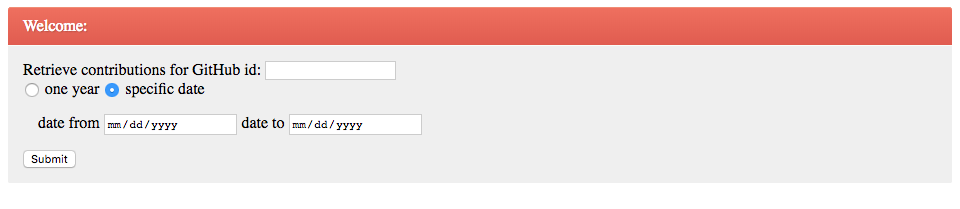

# git-get-contributions

This project can be used to calculate the Git contributions for a particular user.

**Assumptions:**
Following rules are used to count a contribution:

1. 1 contribution, if the user opens an issue, 
2. 1 contribution, if the commit is made on a master repository
3. 1 contribution, if the user opens a pull request on a master repository.

As per my research, GitHub API does not provide information about the private repos, or the commits to private repos. 
Hence, contributions to private repos couldnt be calculated.

## gitGetContributionsCommandLine ##
imports required:
* import requests
* import json
* import datetime
* import threading

Use `python GitApi.py` to run GitApi.py

The output of this would be of the following format: [0, 5, 3, 15, 0 ... 1, 19] where 0 is the number of contributions 365 days ago, 5 the number of contributions 364 days ago, 1 the number of contribution yesterday, 19 the number of contributions of today etc…

## gitGetContributionsRestWebApp ##
imports required:
* import requests
* import json
* import datetime
* import threading
* from flask import Flask, jsonify, request
* from flask import render_template

If your environment does not have flask. Use `pip install flask` to install it.

Execution Instructions:
Run the `startRestAPI.sh` script to start the server.

The server would start running locally, with following output in the shell:
```
Serving Flask app "RestGitApi"
Running on http://127.0.0.1:5000/ (Press CTRL+C to quit)
```

On your browser, goto http://localhost:5000/login
Following screen would appear:


After Entering your details, and logging in, you would be redirected to a page like:


The output at the end is a Map containing all the Dates and the contributions on those dates as Key-value pairs


